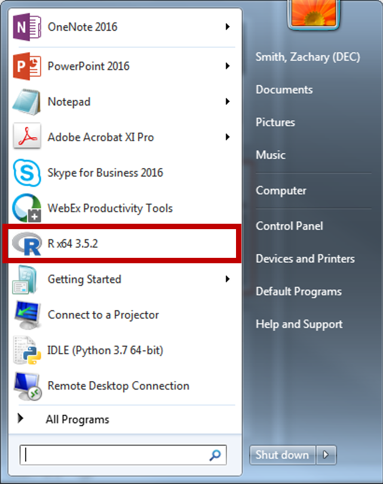
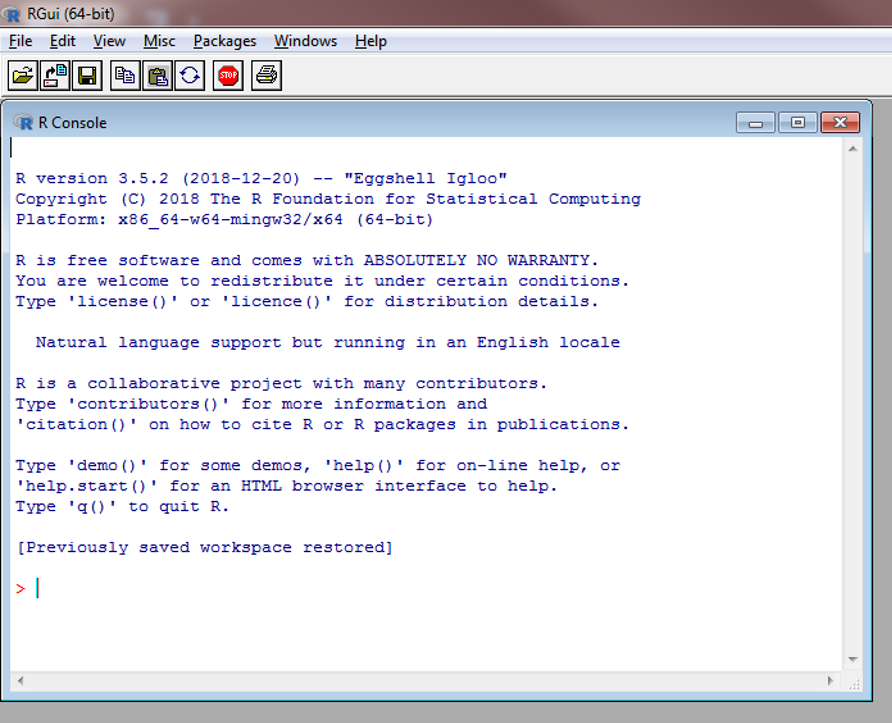
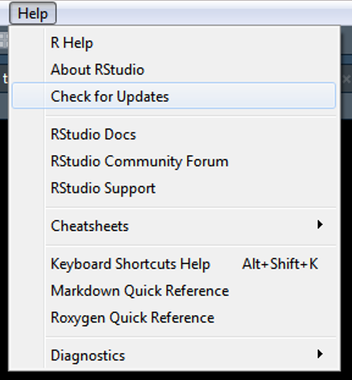
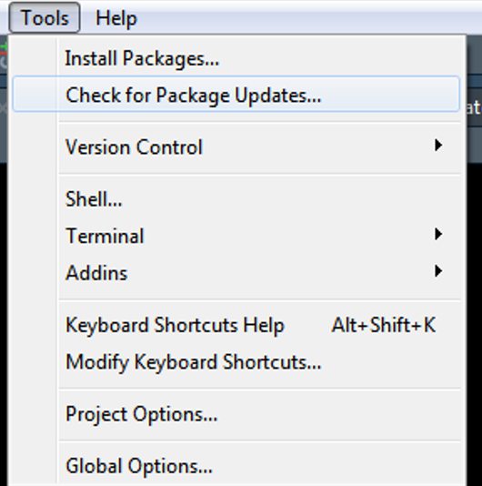
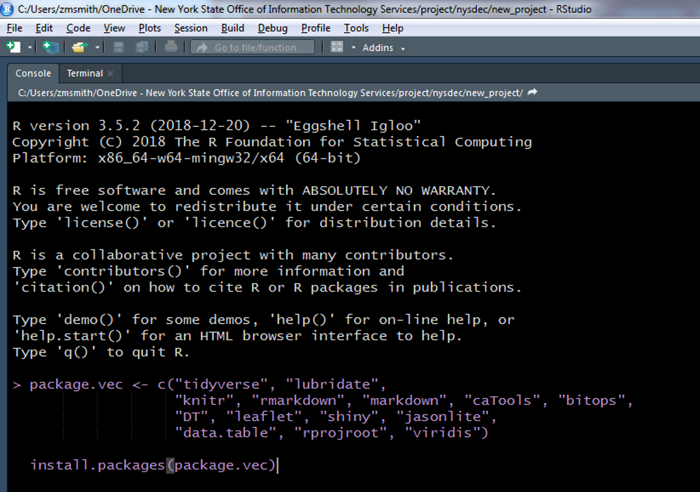

# Installation Links

Please install R and RStudio by following the links below. I highly recommend that you also install Git (link below) and create an account on GitHub (link below). The Git related tools are very useful but some workplaces will not allow the use of these tools for security reasons. Therefore, I will briefly cover Git but you are not required to use these tools during the workshop.
```{r, echo=FALSE}
urls <- c("https://cran.r-project.org/bin/windows/base/",
          "https://www.rstudio.com/products/rstudio/download/#download",
          "https://git-scm.com/downloads",
          "https://github.com")
link.df <- data.frame(
  Software = c("R", "RStudio", "Git", "GitHub"),
  Link = paste0("[", urls, "](", urls, ")")
)

knitr::kable(link.df)
```

## Updating Software and Packages

### R

Run the following code in the RGui, __NOT__ in RStudio. The RGui should be installed when you install R. On my Windows machine, I access R by clicking on the R program file, "R x64 3.5.1".

<center>
{width=400px} 
</center>

You should get a window like this if you have opened the correct program.

<center>
{width=400px} 
</center>

This code was copied from: https://www.r-statistics.com/2013/03/updating-r-from-r-on-windows-using-the-installr-package/). Make sure R Studio is closed before running this code within the RGui.
```{r, eval=FALSE}
# installing/loading the package:
if(!require(installr)) {
install.packages("installr");
require(installr)
} #load / install+load installr

# using the package:
updateR()
```

### RStudio

1. Open RStudio
2. Click on "Help" on the toolbar
3. Click on "Check for Updates"
4. Follow instructions 

<center>
{width=400px} 
</center>

### R-Packages

1. Open RStudio
2. Click on "Tools" on the toolbar
3. Click on "Check for Package Updates…"
4. Follow instructions 

<center>
{width=400px} 
</center>

#### Packages for Workshop

Please run the following code within RStudio to make sure you have all of necessary packages for this workshop installed.

1. Open RStudio
2. Copy the following code

```{r, eval=FALSE}
package.vec <- c("tidyverse", "lubridate",
                 "knitr", "rmarkdown", "markdown", "caTools", "bitops",
                 "DT", "leaflet", "shiny", "jsonlite",
                 "data.table", "rprojroot", "viridis")

install.packages(package.vec)
```

3. Paste the code into the Console within RStudio

<center>
{width=400px} 
</center>

4. Hit Enter
    + If prompted with "Do you want to restart R prior to installing?", select "Yes"
    + If prompted again then select "No"
5. The packages should begin to install. This may take some time.


