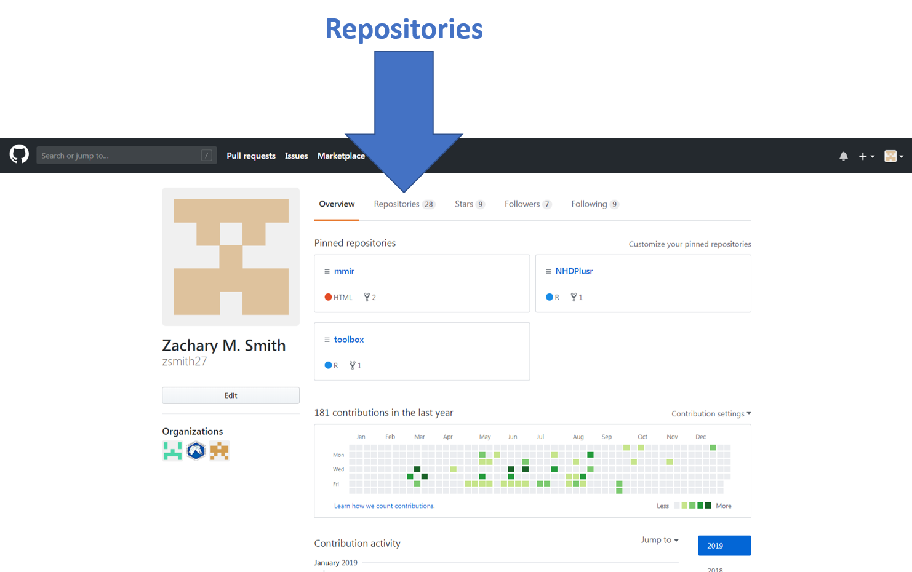
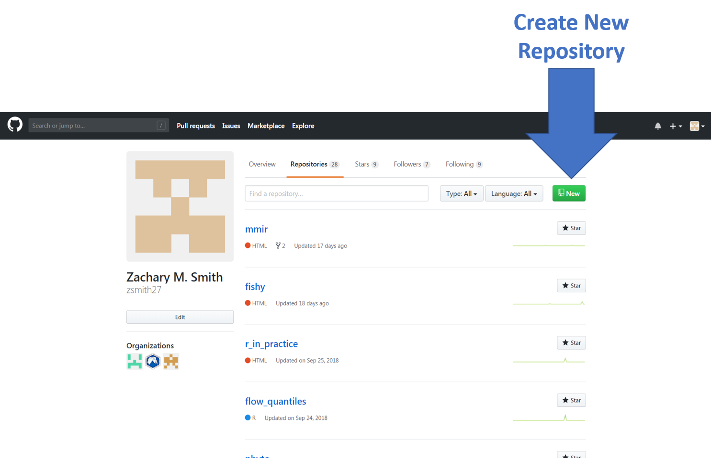
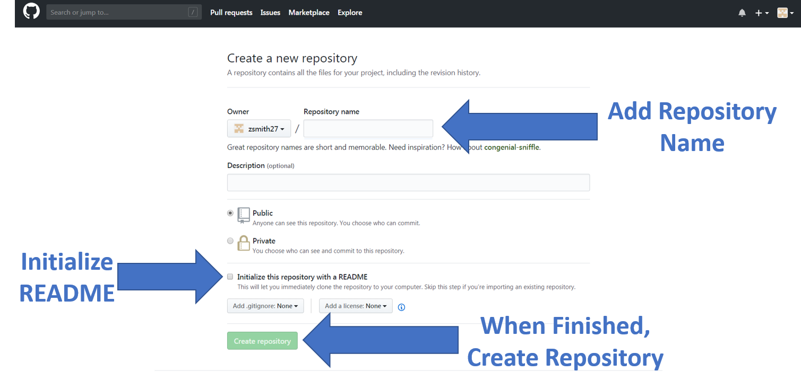
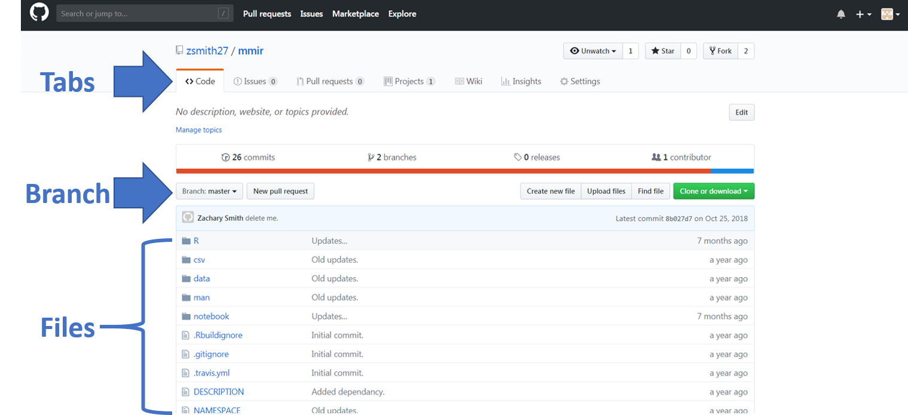
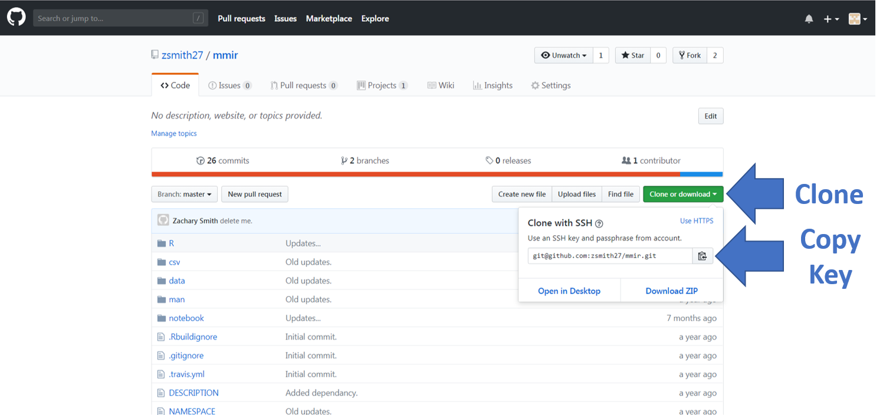
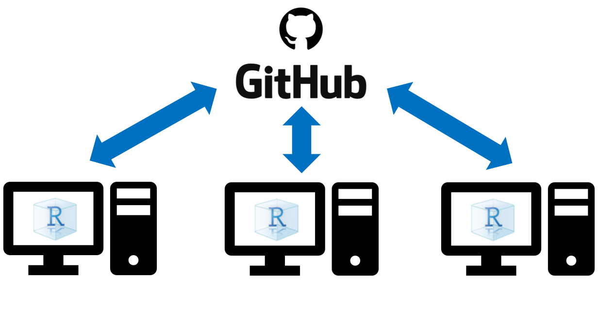
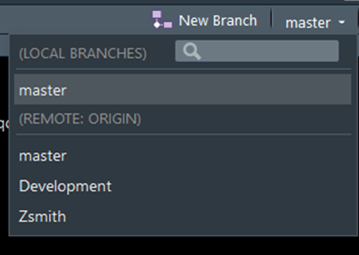
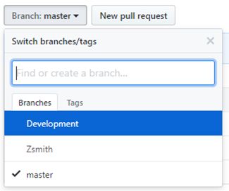
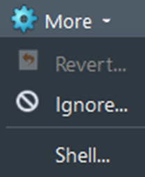

# Version Control

Version control software keeps track of changes made to files. This provides the user with the ability to revert changes back to an earlier version, a backup of the files, and simplifies collaboration efforts.

Git is a free open source version control system (https://git-scm.com/) and GitHub is a platform that allows the user to store their changes made via Git in the form of repositories (https://github.com/). R Studio has integrated Git into their R Studio IDE, making it easy to work with repositories from GitHub (https://support.rstudio.com/hc/en-us/articles/200532077-Version-Control-with-Git-and-SVN). Git will need to be installed locally (https://git-scm.com/downloads) and a GitHub account will need to be to be created (https://github.com/join?source=header-home) before these tools can be accessible from R Studio.

## Git Resources

* __Link:__ https://git-scm.com/doc

## Link R Studio to GitHub Repository
Below are the steps for initializing an R project file connected to a GitHub repository. It is much easier to create the GitHub repository prior to creating project. 

1.	Create a new repository online on your GitHub account
    + Navigate to your GitHub account (https://github.com/)
    + Click on the "Repositories" tab
    
    
    + Click on the "New" button to create a new repository
    
    
    + Add a repository name, initialize the creation of a README file, and click "creat repository"
    
    
    + Find the "clone or download" button on your repository page and copy the SSH key
    
    
    
    
2.	Create a new project in R Studio (File -> New Project).

3.	Select Version Control and Git (Version Control -> Git).
4.	I believe R Studio should automatically recognize Git on your computer but I had to specify where the git.exe was located by going to Tools -> Global Options -> Git/SVN -> locate git.exe (my file path: “C:/Users/zsmith/AppData/Local/Programs/Git/bin/git.exe”).
5.	Paste the repository URL (https://github.com/username/repository.git) into the “Repository URL” box in the R Studio window.
6.	Copy the repository URL from GitHub.
7.	Within the repositories “Code” tab select the green button labeled “Clone or Download.”
8.	Copy the HTTPS URL provided.
9.	Use the “Create project as sub-directory of:” box to manage where you want to store the project on your computer.
10.	Click “Create Project.” The project will now be linked to the GitHub repository. A “Git” tab will appear within the “Environment” pane in R Studio.
If you have an existing R project without a repository on GitHub and you would like to start using version control, I recommend starting from scratch. Create a GitHub repository, connect to a new R Studio project file, and copy the old R project files into the new R project folder.

## Push and Pull Repository Changes in R Studio

Whenever updates are made to the files within the R project folder, they will be queued in the “Git” tab that appears in “Environment” pane in R Studio. 

### Pull

Pull every time you open the project to make sure you have the most up-to-date version of the repository. Changes may have been made by you from a different computer or by one of your collaborators. 

### Commit

A commit is an informative message to yourself or collaborators indicating why you made a change. When the “Commit” button is selected, an “RStudio: Review Changes” window will appear. In this window all of the altered files will appear in the upper left pane. By selecting an individual file in the upper left pane, the user can see the changes that were implemented in bottom pane of the “RStudio: Review Changes” window. Deletions will appear in red, while insertions will appear green. One or more files can be staged and then the user has three options: 1) Revert, 2) Ignore, or 3) Commit. 

1.	The “Revert” button will revert the staged file(s) to the previous state that is available in the GitHub repository. 
2.	The “Ignore” button will add the staged file(s) to the .gitignore file. The .gitignore file informs Git that a file should not be added to the GitHub repository and subsequent changes to the file should not be added to the GitHub repository. GitHub will prevent users from pushing large data sets, and thus large data sets should be added to the .gitignore file. Also, files containing sensitive information (e.g., usernames or passwords) should be added to the .gitingore file.
3.	Staged file(s) require a commit message, an informative message indicating why a change was made, prior to being committed. All commits remain local until the “Push” button is used to send the changes to the GitHub repository.

### Push

Push commits from R Studio to the GitHub repository.

## Repository Branch

When a repository is created it consist of a single branch labeled “master.” The master branch will suffice as you first develop the app. However, you may reach a point where the master branch is functioning well (without any known issues) but you want to make some dramatic development changes. Rather than committing the changes to the master branch (potentially breaking your working product), you can create a new isolated branch to work on your development changes. In this case, the branch would clone the current state of the master, and then any edits made to the new branch would not impact the master branch.

When working in R Studio with GitHub, use the drop-down menu (located in the top right corner of the Git tab in the Environment pane) to select the branch you want to work on. In the image below I clicked on “master” and now I can see three branches are available for this project: 1) master, 2) Development, and 3) Zsmith. Simply select a name to change the branch you are working on.

### Create a New Branch

Creating a new branch is relatively simple. There are three ways that I know how to create a repository branch: 1) via R Studio, 2) via GitHub, and 3) via Git Shell.

####	R Studio

In the “Git” tab of the Environment pane in R Studio, there is button for creating a new branch. Click on this button: 

####	GitHub

Log on to your GitHub online GitHub account (https://github.com/) and navigate to the repository you are working on. Under the “Code” tab, click on the “Branch:” button. This will produce a drop down menu (as seen in the image below), where you can select an existing branch or create a new branch by typing the name you want to assign your new branch into the input box labeled “Find or create a branch.” Once you type in the new name, a new box will appear in the dropdown menu that says “Create Branch”. Click on this box to create the new branch.

####	Git Shell

The Git Shell can be accessed via R Studio in the Git tab of the Environment pane. Click on the “More” dropdown menu and then click “Shell…” (see image below). 

A new window will appear. Use this link to understand how to create and work with branches in the Git Shell: https://git-scm.com/book/en/v2/Git-Branching-Basic-Branching-and-Merging.

##	Merge Branches

After you have vetted a new branch, you can merge the new branch with the master branch (or some other branch). The merge will join all the changes made in the new branch and all of the changes made in the master branch. You may run into conflict issues if both branches updated the same section of code (https://help.github.com/articles/resolving-a-merge-conflict-using-the-command-line/).

Merging branches is not as simple as creating branches. As far as I know, branches can only be merged using the Git Shell (see Git Shell to learn how to access the Git Shell). Use the following link to understand how to merge branches: https://help.github.com/articles/merging-an-upstream-repository-into-your-fork/ 

