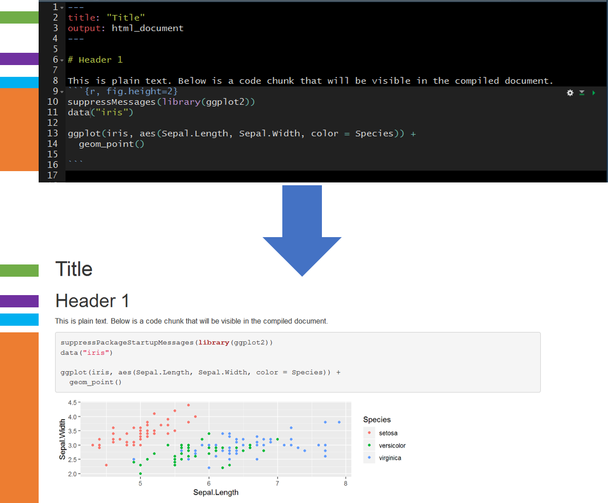

# R Markdown

<center>
{width=200px} 
</center>

* __R Markdown: The Definitive Guide:__ https://bookdown.org/yihui/rmarkdown/
* __RStudio Lessons:__ https://rmarkdown.rstudio.com/lesson-1.html

Markdown is a markup language for developing and formating documents. R Markdown is an R-package that allows the user to integrate text, R-code, and R-code output into a well formatted document (e.g., HTML, MS Word, PDF). 

<center>

</center>

My recommendation is to create an R Markdown file for every R-project. The intention is to document as much of the project as possible.  R Markdown provides a more readable document, with better descriptions of how and why an activity was performed, than a standard R script with a few commented lines. 

## Benefits

* __Reproducible:__ Document steps of an investigation or scientific study [reproducibility crisis](https://www.nature.com/news/1-500-scientists-lift-the-lid-on-reproducibility-1.19970).
<center>
{width=400}
</center>

* __Collaborative:__ Easy to work with others on investigations and scientific studies.
<center>
{width=400}
</center>

* __Efficient:__ Generate and update reports automatically (e.g., HTML, MS Word, and PDF).
<center>
{width=400}
</center>

* __Engaging:__ Embed interactive figures, maps, and tables in reports (HTML only).
    + __Source:__ https://plotly-book.cpsievert.me/images/gapminder-highlight-animation.gif

<center>
{width=400}
</center>

## Basic Overview

Use markdown syntax, some of which is shown in the table below, to format the document.

* __Source:__ https://www.rstudio.com/wp-content/uploads/2015/03/rmarkdown-reference.pdf

<center>
{width=400}
</center>

Once the document is complete (formated with markdown syntax with integrated R code) the document can be knit (rendered) using the package __knitr__.

Here is a simple example showing the raw R Markdown (Rmd) file before knitting (rendering) and after knitting. The colors on the far left are ther to help identify elements pre- and post-knitting.

<center>
{width=400}
</center>


R is not the only language supported by R Markdown. The following languages and more can be integrated into an R Markdown file.

<center>
{width=400}
</center>


##	Create a New Document

1. Click on the new document buttion: 

2. Click on R Markdown:

{width=150px}

3. Provide a "Title:", select the "Defualt Output Format:", and click "OK"

{width=250px}

4. A new R Markdown document will appear with some instructions and example text/code. Delete everything after the YAML header:
```{r, eval=FALSE}
---
title: "Untitled"
author: "Zachary M. Smith"
date: "September 23, 2018"
output: html_document
---
```

## Editing

Again, your best resource for learning how to use R Markdown will be the R Markdown website (https://rmarkdown.rstudio.com/lesson-1.html), but I will describe some of the general features here.

### YAML Header

__YAML:__ YAML Ain’t Markup Language

#### Standard

<center>

</center>

#### Table of Contents (TOC)

<center>

</center>

#### Floating Table of Contents (TOC)

<center>

</center>

###	Heading Text

Heading text follows one or more hash-sign(s) (#). The number of hash-signs determines the hierarchy of headings. For example, “# Heading 1” would represent the primary heading, “## Heading 2” would represent the secondary heading, “###Heading 3” would represent the tertiary heading, and so forth.

###	Plain Text

Simply add text below the YAML header.

###	Insert Code Chunks

To insert a code chunk, press Ctrl + Alt + i in the source pane (top left pane in the default settings of Studio). A code chunk will appear:


Inside the code chunk you can write and run R-code. If you print the output of your R-code it will appear below the code chunk in the source pane and the printed output will appear in the final compiled document. This is useful for producing figures and tables.


##	Compile the Document

To view the html document, you must compile the document using Knit. Follow these steps to Knit the document:

1.	Find and click the Knit button (it looks like a ball of yarn) in the toolbar above the editor window. {width=80px}

2. If a window appears saying “Install Required Packages” for R Markdown, install the necessary packages for knitting the document.
3. The compiled file will be saved in the same directory as your Rmd file (your R Markdown file).

## File Management

I store the R Markdown file(s) in a sub-directory labeled “markdown” within the R-project folder (rproject/markdown).

##	Child Documents

In general, I find that a single R Markdown file quickly becomes unwieldy. I recommend breaking the document up into multiple “child” documents and sourcing these child documents in a parent document. My child documents generally represent major subsections of the document. 

I store the parent R Markdown file in the “markdown” folder (rproject/markdown) and the child R Markdown files in a sub-directory of my “markdown” folder called “sections” (rproject/markdown/sections). In the parent file, the child files are sourced within the code chunk header using “child = ‘sections/example.Rmd’. After sourcing all the child chunks, the parent file can be knit (compiled) like a normal R markdown document. The child documents cannot be run in the parent file.


### Extract and Run R-Code from R Markdown Files

The parent file is great for organizing sections of your document, but the child documents cannot be executed within R Studio like a normal code chunk. Without the ability to easily execute the R code within the child documents it can become very difficult to develop new child documents because new child documents often depend on upstream code execution. 

Imagine you have a parent document that sources child sections which import your data and clean your data. You now want to visualize your data; accordingly, you begin to develop a visualization child document, which depends on information from the upstream child sections. It would be inefficient and inappropriate to perform all the steps in the upstream child sections within the visualization section. Therefore, you need an effective way to execute the upstream child sections while you continue to develop the visualization section. The inefficient way of doing this is to open each child Rmd file in R Studio and execute them manually in the correct sequence. This becomes tedious after you have three or more documents (imagine doing this for 10+ child sections). The most efficient way that I have found to run upstream child sections is to extract the R-code chunks from each Rmd file, save them in a “raw_scripts” folder, and then source/execute the scripts within a regular R script file (.R).

####	R Code

In this section we establish the file path to the folder that contains all the child documents. The names of the child documents are extracted and stored as a vector. The grepl() function is used to retain only the Rmd files stored in the vector.

```{r, eval=FALSE}
sections.path <- file.path(rprojroot::find_root("r_in_practice.Rproj"),
                           "markdown",
                           "sections")
r.files.vec <- list.files(sections.path)
r.files.vec <- r.files.vec[grepl(".Rmd", r.files.vec)]
```

Next, a file path is specified for the R-scripts that will be extracted from the R Markdown documents; I place these files within a “raw_script/extracted” folder. The map() function from the purrr package is used to loop through each file in the vector (r.files.vec). Within the map() loop,  the purl() function from knitr is used to extract the R-code from the R Markdown documents and save the code to the specified folder.
```{r, eval=FALSE}
extracted.path <- file.path(rprojroot::find_root("r_in_practice.Rproj"),
                           "markdown",
                           "raw_scripts",
                           "extracted")

purrr::map(r.files.vec, function(file.i) {
  # print(file.i)
  file.name <- gsub(".Rmd", "", file.i)
  extracted.file <- paste0(file.name, ".R")
  knitr::purl(
    file.path(sections.path, file.i),
    file.path(extracted.path, extracted.file)
    )
})
```

Finally, create a vector of file names (source.vec) stored in the “raw_script/extracted” folder. You will want to type these out manually (do not use list.files() functions) because in this format you can easily comment out certain scripts and only run the scripts of interest. The map() is then used to loop through each specified file in source.vec. Keep in mind that the order of the file names specified in source.vec will determine the order that these files are executed in the map() function; therefore, order the files in source.vec from furthest upstream to furthest downstream. Each iteration of the loop, executes (sources) the specified R-script. 
```{r, eval=FALSE}
source.vec <- c(
  "introduction.R",
  "quick_reference.R",
  "installation_updates.R",
  "r_project.R",
  "version_control.R"
)

purrr::map(source.vec, function(source.i) {
  source(file.path(extracted.path, source.i))
})
```

Once all the R-scripts extracted from the upstream child R Markdown files have been executed, you can begin or continue work on a new child R Markdown document. I keep all the above code in a single R-script and execute the entire script each time I use this file to make sure all of the files are up-to-date. 

## Parameterized Reports

https://www.coursera.org/lecture/reproducible-templates-analysis/adding-parameters-in-a-document-template-6fQwc