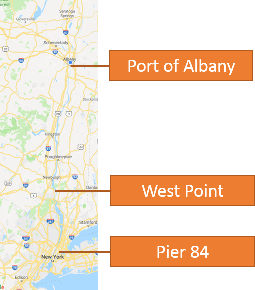
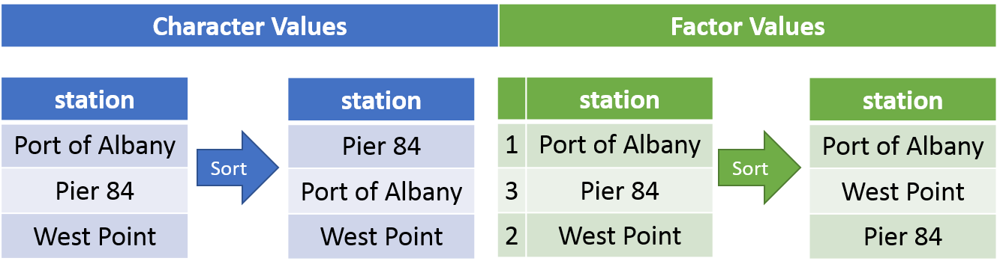

# Base R

## Data Types

### Numeric (Double)

* Can include integers and decimal numbers (continuous variables)
* __EXAMPLE:__
```{r}
is.numeric(c(1, 2, 3.5, 6.7))
is.numeric(c(1, 2, 3, 6))
is.numeric(1:5)
is.numeric(c(TRUE, FALSE, TRUE))
is.numeric(c("a", 2, 3, 6))
is.numeric(c("a", "b", "c", "d"))
```

### Integer

* Only whole numbers (discrete variables)
* From `is.integer()`help file: "is.integer(x) does not test if x contains integer numbers!"
* __EXAMPLE:__
```{r}
is.integer(c(1, 2, 3.5, 6.7))
is.integer(c(1, 2, 3, 6))
is.integer(1:5)
is.integer(c(TRUE, FALSE, TRUE))
is.integer(c("a", 2, 3, 6))
is.integer(c("a", "b", "c", "d"))
```

### Logical 
* TRUE or FALSE values
* __EXAMPLE:__
```{r}
is.logical(c(1, 2, 3.5, 6.7))
is.logical(c(1, 2, 3, 6))
is.logical(1:5)
is.logical(c(TRUE, FALSE, TRUE))
is.logical(c("a", 2, 3, 6))
is.logical(c("a", "b", "c", "d"))
```

### Character
* Alphanumeric
* __EXAMPLE:__
```{r}
is.character(c(1, 2, 3.5, 6.7))
is.character(c(1, 2, 3, 6))
is.character(1:5)
is.character(c(TRUE, FALSE, TRUE))
is.character(c("a", 2, 3, 6))
is.character(c("a", "b", "c", "d"))
```

### Factor
* A special integer vector to assign order
* __Use:__ assign custom order to categorical variables
    + If you were to sort a character vector, R would sort the vector alphabetically.
* __EXAMPLE:__
```{r}
is.factor(c(1, 2, 3.5, 6.7))
is.factor(c(1, 2, 3, 6))
is.factor(1:5)
is.factor(c(TRUE, FALSE, TRUE))
is.factor(c("a", 2, 3, 6))
is.factor(c("a", "b", "c", "d"))
```
    
Example of sorting a character vector.
```{r}
sort(c("a", "b", "c", "d"))
```
    
Example of sorting a factor vector.
```{r}
sort(factor(c("a", "b", "c", "d"),
            levels = c("d", "a", "c", "b")))
```

```{r}
as.numeric(sort(factor(
  c("a", "b", "c", "d"),
  levels = c("d", "a", "c", "b")
  )))
```


#### Example

In this example there are three stations on the Hudson River (i.e., Port of Albany, West Point, and Pier 84). 

<center>

</center>

Although this is a tidal river, we would generally want to sort and plot this data from upstream to downstream (i.e., Port of Albany, West Point, and Pier 84). The table below shows how `sort()` would arrange the data if it is stored as a character vs. factor type.

<center>

</center>

