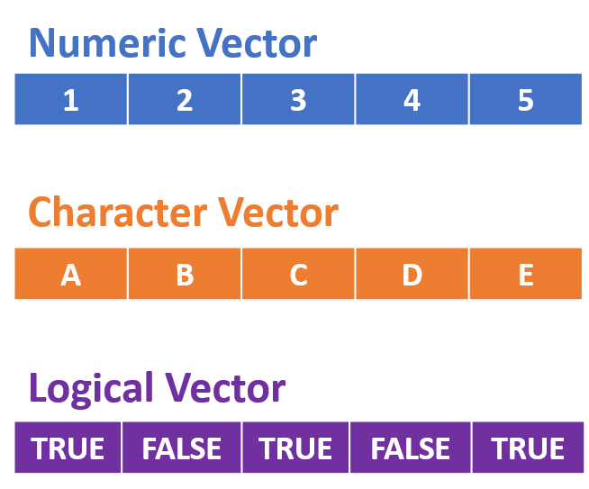
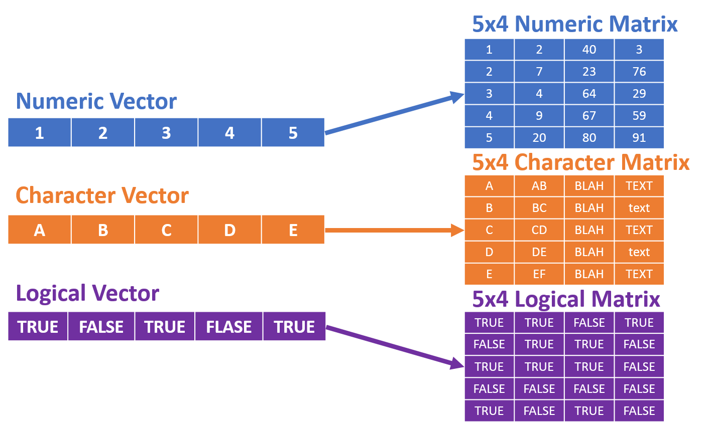
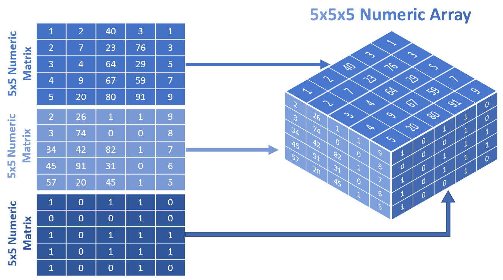
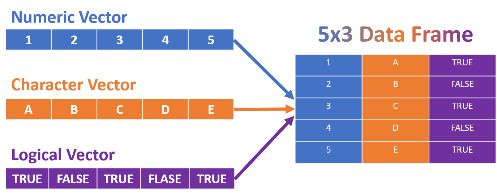
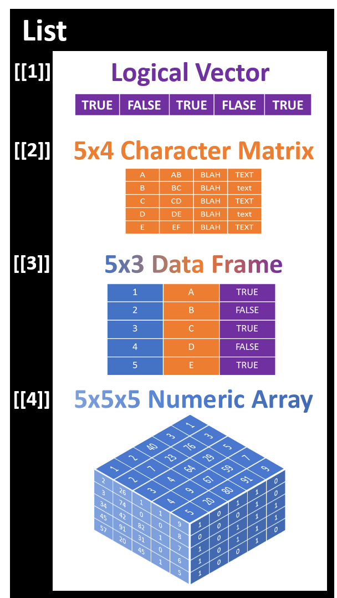

# Data Structures

__Common Data Structures:__

* Vectors
    + 1 Dimensional
    + Homogenous data type
* Matrices
    + 2 Dimensional
    + Homogenous data type
* Arrays
    + Greater than 2 Dimensions
    + Homogenous data type
* Data Frames
    + 2 Dimensional
    + Heterogenous data types
* Lists
    + Can contain various data types (vectors, matrices, arrays, and data frames)
    + Heterogenous data types
    
## Vectors

* 1 Dimensional
* Homogenous data type

<center>
{width=400}
</center>

Numeric vector
```{r}
c(1, 2, 3, 4, 5)
```

Character Vector
```{r}
c("A", "B", "C", "D", "E")
```

Logical vector
```{r}
c(TRUE, FALSE, TRUE, FALSE, TRUE)
```

## Matrices

* 2 Dimensional
* Homogenous data type



```{r}
matrix(c(1:5, 2, 7, 4, 9, 20, 40, 23, 64, 67, 80, 3, 76, 29, 59, 91),
       ncol = 4)
```

## Arrays

* Greater than 2 Dimensions
* Homogenous data type



```{r}
array(c(c(1:5, 2, 7, 4, 9, 20, 40, 23, 64, 67, 80, 3, 76, 29, 59, 91, 1, 3, 5, 7, 9),
        c(2, 3, 34, 45, 57, 26, 74, 42, 91, 20, 1, 0, 82, 31, 45, 1, 0, 1, 0, 1, 9:5),
        c(1, 0, rep(1, 3), rep(0, 5), 1, 0, 1, 1, 0, rep(1, 5), 0, 0, 1, 1, 0)),
      c(5, 5, 3))
```

## Data Frames

* 2 Dimensional
* Heterogenous data types



```{r}
data.frame(
  Numeric = c(1, 2, 3, 4, 5),
  Charcter = c("A", "B", "C", "D", "E"),
  Logical = c(TRUE, FALSE, TRUE, FALSE, TRUE),
  stringsAsFactors = FALSE
)
```

## Lists

* Can contain various data types ([Vectors], [Matrices], [Arrays], and [Data Frames])
* Heterogenous data types

<center>
{width=400}
</center>

```{r}
list(
  c(TRUE, FALSE, TRUE, FALSE, TRUE),
  matrix(c("A", "B", "C", "D", "E",
           "AB", "BC", "CD", "DE", "EF",
           rep("BLAH", 5),
           "TEXT", "text", "TEXT", "text", "TEXT"),
         ncol = 4),
  array(c(c(1:5, 2, 7, 4, 9, 20, 40, 23, 64, 67, 80, 3, 76, 29, 59, 91, 1, 3, 5, 7, 9),
        c(2, 3, 34, 45, 57, 26, 74, 42, 91, 20, 1, 0, 82, 31, 45, 1, 0, 1, 0, 1, 9:5),
        c(1, 0, rep(1, 3), rep(0, 5), 1, 0, 1, 1, 0, rep(1, 5), 0, 0, 1, 1, 0)),
      c(5, 5, 3)),
  data.frame(
    Numeric = c(1, 2, 3, 4, 5),
    Charcter = c("A", "B", "C", "D", "E"),
    Logical = c(TRUE, FALSE, TRUE, FALSE, TRUE),
    stringsAsFactors = FALSE
  )
)
```

