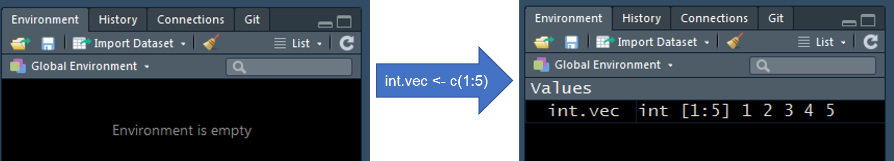
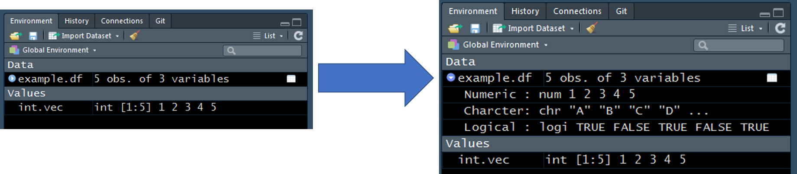

# Data Structure Manipulation

## Assignment Opperator (`<-`)

The assignment opperator (`<-`) is used to assign data structures to a named object that will be stored in the Environment. The object on the left side of the assignment opperator is going to refer to a new or existing data object. The object to the right of the assignment opperator is going to represent the data that we want to store in the object to the left of the opperator. When the code is executed, the object will be stored in the Environment, which is visible within the RStudio Environment window.

For example, the integer vector from 1-5, created using `c(1:5)`, is stored with the object name, `int.vec`. The image below this code chunk, shows the Environment before and after the code has been executed. We can see that `int.vec` has been added to the Environment.
```{r}
int.vec <- c(1:5)
```

<center>

</center>

Here is an example of a data frame being stored as an object, `example.df`. See [Environment Tab] section to review the helpful tools available in RStudio for viewing elements of a data frame.
```{r}
example.df <- data.frame(
  Numeric = c(1, 2, 3, 4, 5),
  Character = c("A", "B", "C", "D", "E"),
  Logical = c(TRUE, FALSE, TRUE, FALSE, TRUE),
  stringsAsFactors = FALSE
)
```

<center>

</center>

## Manipulting Vectors

```{r}
char.vec <- c("a", "b", "c", "d", "e")
char.vec
```

```{r}
char.vec[3]
```
```{r}
char.vec[c(1, 3)]
```

The colon opperator can be helpful for grabbing a sequential range. Here I am specifiying elements 1, 2, and 3 of `char.vec`.
```{r}
char.vec[1:3]
```

## Manipulating Data Frames

This data frame will be used as an example in this section.
```{r}
example.df <- data.frame(
  Numeric = c(1, 2, 3, 4, 5),
  Character = c("A", "B", "C", "D", "E"),
  Logical = c(TRUE, FALSE, TRUE, FALSE, TRUE),
  stringsAsFactors = FALSE
)
knitr::kable(example.df)
```

When dealing with data frames think of the square brackets (`[, ]`) as a coordinate system. Values specified to the left of the comma in `[, ]` represents rows, while everything to the right of the comma represents columns. 
```{r}
example.df[, 1]
```
```{r}
example.df[1, ]
```

```{r}
example.df[1, 1]
```

```{r}
example.df[1:2, 1:2]
```

```{r}
example.df$Numeric
```

```{r}
example.df[, "Numeric"]
```

```{r}
example.df[example.df$Numeric == 1, ]
```

```{r}
example.df[example.df$Character %in% c("A", "C"), ]
```

```{r}
example.df[example.df$Character %in% c("A", "C"), "Numeric"]
```

## Importing Data

### file_path

`file_path()` is a clean way of specifying a file path. You do not have to remember if you need to seperate folders by "/" or "\", file.path will do it for you (It's "/", by the way).
```{r}
file.path("data",
          "zms_thesis-macro_2017-06-18.csv")
```

### read.csv

One way to import data is to use `read.csv()`. This is specific to importing comma seperated value (CSV) files. In general, you just need to supply the path to the CSV file (tell `read.csv()` where the cSV file lives) and specify `stringsAsFactors = FALSE`. The default for `read.csv()` is `stringsAsFactors = TRUE`, which will make all columns filled with character strings factor columns upon import. This typically not the behaviour we want, so I recommend setting `stringsAsFactors = FALSE`. My opinion is that factors should be specifically defined after the data has been imported.

I have provided my thesis data as an example data set for this document. The data represents benthic macroinvertebrate data collected in the littoral zone of Onondaga, Otisco, and Cazenovia lakes 
```{r}
taxa.df <- read.csv(file.path("data",
                              "zms_thesis-macro_2017-06-18.csv"),
                    stringsAsFactors = FALSE)

DT::datatable(taxa.df, options = list(scrollX = TRUE))
```

