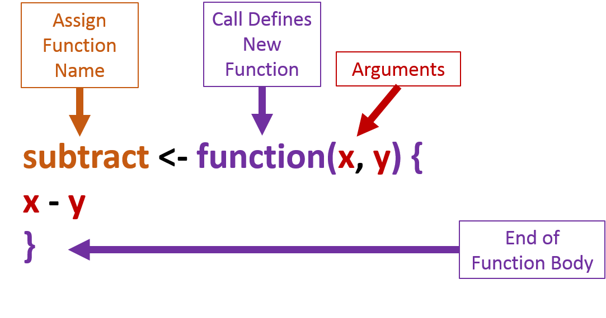

# Writing Functions

It is highly recommended that you learn to write your own functions. In general, anytime you have the urge to copy and paste code to perform a similar process on a different aspect of your data you should instead write a function. A function is a single standardized process that you apply to similar data sets. Therefore, it is easier to update the function rather than multiple chunks of code that have been copied and pasted throughout your script. For example, imagine you have copied and pasted code ten times. Later you want to update the code. Now you have to update all ten instances of the code. This is time consuming and it would be easy to miss or add a typo to one of the ten instances. If the process is stored as a function, you make one update to the function and that update is applied in a standardized manner to all ten instances of your data.

The image below provides an overview of the pieces necessary to create a function. Use `function()` to initialize the creation of a new function. Within function you will, generally, add arguements (in example below: `x, y`) that you will want to be able to modify. Curly brackets (`{}`) following the `function()` call define the extent of the body of the function being created. Within the curly brackets is wher most of the work is performed; this is the area where we insert our code that we want to become a standarized process. This example is very simple, just `x -y`, but you could insert 100+ lines of code into a function. However, really lenghty functions are poor practice. Finally, the function needs to be stored as an object. Use the assignment opperator (`<-`) to assign this function an object name (e.g., `subtract <- `). 

<center>

</center>

Let us actually create this function.
```{r}
subtract <- function(x, y) {
  x - y
}
```

Once this function has been executed, it is stored as a object named "subtract". This object can be seen in the Environment window. 

<center>
{width=400}
</center>

Now we can test our function.
```{r}
subtract(x = 10, y = 5)
```

We can get the same results without specifically calling out `x` and `y`. R will assume that you understand the order of the arguements is `x, y`, and therefore 10 will represent `x` and 5 will represent `y`.
```{r}
subtract(10, 5)
```

If we reverse the order, then 5 represents `x` and 10 represents `y`.
```{r}
subtract(5, 10)
```

Our intention with the created subtract function is to subtract one value from another. However, the code in the chunk below will run. In this code `x` represents the numeric vector `c(1, 2, 3)` and `y` represents the numeric vector `c(3, 2, 1)`. 
```{r}
subtract(c(1, 2, 3), c(3, 2, 1))
```

We only want this function to execute if `x` and `y` are each of length one. A conditional `if()` statement combined with a `stop()` function can be used to prevent the function from working on data that does not meet our requirements (`x` of length 1 and `y` of length 1). Note that this update would normarlly be made to the orginal function call up above. `subtract()` is only updated here to show the progression of our development of this function.
```{r}
subtract <- function(x, y) {
  if (length(x) != 1 | length(y) != 1) stop("x and y must length 1")
  x - y
}
```

Now if a vector of length 3 is provided for the `x` or `y` arguments, the function will return an error with the message "x and y must length 1." This is the message that was defined in the `stop()` call within the creation of the `subtract()` function above.
```{r, error=TRUE}
subtract(c(1, 2, 3), c(3, 2, 1))
```

Double check that the original values still work. 
```{r}
subtract(10, 5)
```

