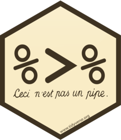

# Tidyverse

* __Link:__ https://www.tidyverse.org/

* __Great Place to Start:__ https://r4ds.had.co.nz/

The tidyverse is an ecosystem of packages that work well together and often make it easier to deal with data in R. These packages are mostly developed and maintained by RStudio staff but contributions are frequently made by members of the R community. 

__WARNING:__ These packages are very helpful but many are not yet stable. There is potential that a function could undergo a large change or be depreciated in the future. This can have a significant negative impact on the reproducibility of your work. The functions in __tidyverse__ packages will generally provide helpful messages indicating if a function has been depreciated and indicate the function that has taken its place. 

Instead of loading each __tidyverse__ package individually, `library(tidyverse)` will load the most frequently used packages: __ggplot2__, __purrr__, __tibble__, __dplyr__, __tidyr__, __stringr__, __readr__, and __forcats__.
```{r}
library(tidyverse)
```


## Tidyverse Directory

{align="right" width=450px}

* Pipe Operator
    + [magrittr]
* Data Structure
    + tibble
* Data Manipulation
    + [dplyr]
    + [tidyr]
* Loops
    + purrr 
* Visualization
    + [ggplot2]
* Dates and Datetimes
    + [lubridate]
    + hms
* Strings
    + stringr
    + glue
* Factors
    + forcats
* Import Data
    + readr
    + readXl
    + haven
* Store Binary Data
    + blob

<center>
{width=200px} 
</center>

## magrittr 

* __Link:__ https://magrittr.tidyverse.org/
* __Index of Functions:__ https://magrittr.tidyverse.org/reference/index.html

```{r}
library(magrittr)
```

### Example Data

This vector will be used as an example for this section. Notice that all of the strings are slightly different. I frequently find issues like this in data sets I have been given. We will assume that all of the strings are intended to represent the same information, and therefore require some processing to standardize the strings.
```{r}
x <- c("example 1",
       " example 1",
       "example 1 ", 
       "example_1")
```

### Pipe Operator (%>%)

I often find that the pipe operator, `%>%`, from the magrittr package is confusing to those unfamiliar with the tidyverse. It takes a little while to wrap your head around the pipe operator but once you do I think you will find its use makes R code more legible. In essence, base R works from the inside-out, while the pipe operator presents the code in a linear fashion. 

For example, imagine you have a character vector x and you want to trim leading/trailing white space, then keep only unique strings, and then convert all characters to lowercase. In base R, the code would look like the code in the chunk below. Again, base R works from the inside-out, so first `trimws()` is used to remove leading/trailing white space, then tolower() is used to convert all characters to lowercase, and finally `str_replace()` is used to replace any spaces with an underscore.
```{r}
str_replace(tolower(trimws(x)), " ", "_")
```

Using the pipe operator, the code functions just the same but it is formatted in a more legible manner: 

1. `x` is piped to `trims()`
2. the output of `trims()` is piped to `tolower()`
3. the output of `tolower()` is piped to `str_replace()`
4. the output of `str_replace()` is returned

The pipe operator presents the functions in the order you intend them to be performed; therefore, the code should be easier to read and more intuitive, which should in turn reduce errors. 
```{r}
x %>% 
  trimws() %>% 
  tolower() %>% 
  str_replace(" ", "_")
```

Most __tidyverse__ packages (e.g., __NOT ggplot2__) are designed to work well with the pipe operator. The pipe operator pushes the call on the left side of the operator to the first position of the function on the right of the operator. Therefore, functions developed outside of the __tidyverse__ may not automatically work will with the pipe operator. A `.` can be used as an a placeholder. 

In the examples above, `str_replace()`, from the __stringr__ package, was used. This function is designed to work well with the pipe operator but what if we wanted to use `gsub()`, the base R equivalent to `str_replace()`? 

* __`str_replace()` structure:__
    + `str_replace(string, pattern, replacement)`

* __`gsub()` structure:__
    + `gsub(pattern, replacement, x)`

In `gsub()`, the `x` arguement is equivalent to the `string` arguement in `str_replace()`. Notice the difference in the order of the arguements. In `str_replace()`, `string` is the first arguement, but in `gsub()`, `x` is the last arguement. Therefore, when using the pipe operator with `gsub()`, the placeholder (`.`) must be used becuase the output from `x %>% trimws() %>% tolower()` by default will be piped into the `pattern` arguement, the first arguement.

Here is the error recieved if the placeholder (`.`) is __NOT__ used:
```{r, error=TRUE}
x %>% 
  trimws() %>% 
  tolower() %>% 
  gsub()
```

Here is how the placeholder(`.`) would be used in a `gsub()` call. `pattern` and `replacement` are speciefied as normal, while `x = .` indicates where the output from `x %>% trimws() %>% tolower()` should be used.
```{r}
x %>% 
  trimws() %>% 
  tolower() %>% 
  gsub(pattern = " ",
       replacement = "_",
       x = .)
```
