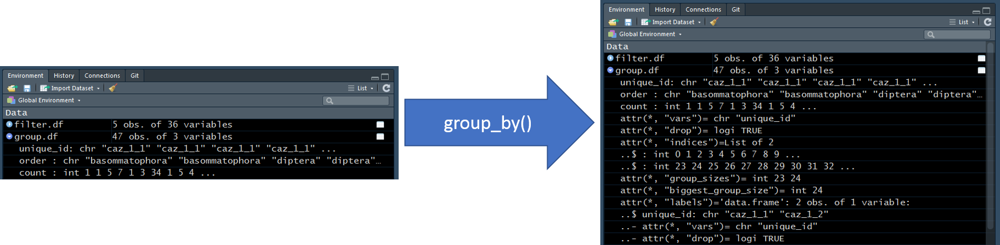
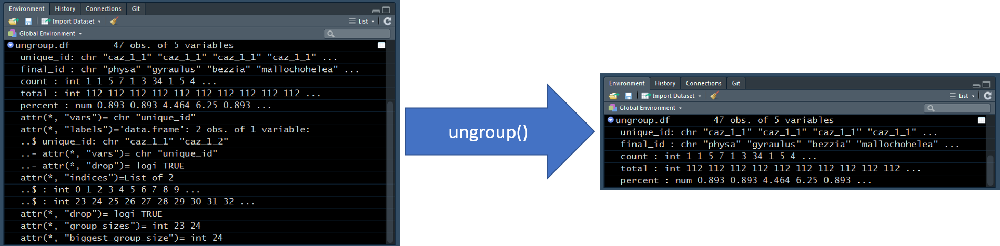

# dplyr

<center>
{width=200px}
</center>

* __Link:__ https://dplyr.tidyverse.org/
* __Index of Functions:__ https://dplyr.tidyverse.org/reference/index.html
* __Cheat Sheet:__ https://github.com/rstudio/cheatsheets/blob/master/data-transformation.pdf
* __Chapter of R for Data Science:__ https://r4ds.had.co.nz/transform.html
* __Unofficial Example:__ https://rpubs.com/williamsurles/293454

```{r}
suppressPackageStartupMessages(
  library(dplyr)
)
```

### Example Data

Import the example data. This data represents benthic macroinvertebrate data collected in the littoral zone of Onondaga, Otisco, and Cazenovia lakes 
```{r}
taxa.df <- file.path("data",
                     "zms_thesis-macro_2017-06-18.csv") %>% 
  read.csv(stringsAsFactors = FALSE)

DT::datatable(taxa.df, options = list(scrollX = TRUE))
```


```{r}
env.df <- file.path("data",
                     "zms_thesis-env_2017-06-18.csv") %>% 
  read.csv(stringsAsFactors = FALSE)

DT::datatable(env.df, options = list(scrollX = TRUE))
```

### Rename

* __Definition:__ give a new name to a specified column(s).
* __Link:__ https://dplyr.tidyverse.org/reference/select.html

In the example below, the columns `lat` and `long` are renamed to `latitude` and `longitude`, respectively. If `names(taxa.df)` is called, elements 5 and 6 are now represented by "latitude" and "longitude", respectively.
```{r}
taxa.df <- taxa.df %>% 
  rename(latitude = lat,
         longitude = long)

names(taxa.df)
```

### Filter

* __Definition:__ subset rows using logical statements. 
* __Link:__ https://dplyr.tidyverse.org/reference/filter.html

In the example below, `taxa.df` is subset to only include rows where the `unique_id` column matches the string "caz_1_1".
```{r}
filter.df <- taxa.df %>% 
  filter(unique_id == "caz_1_1")

DT::datatable(filter.df, options = list(scrollX = TRUE))
```

You can apply multiple filters separate by commas. The filters are applied from the top down. In the example below, two filters are applied within the `filter()` call:

1. `unique_id == "caz_1_1"`
2. `order %in% c("ephemeroptera", "trichoptera")`

The first logical statement is the same as the filter from the code chunk above, which keeps only rows associated with the sample "caz_1_1". Then, the `order` column is subset the data to only include rows represented by ephemeroptera (mayfly) or trichoptera (caddisfly) taxa.
```{r}
filter.df <- taxa.df %>% 
  filter(unique_id == "caz_1_1",
         order %in% c("ephemeroptera", "trichoptera"))

DT::datatable(filter.df, options = list(scrollX = TRUE))
```

### Select

* __Definition:__  subset of columns. 
* __Link:__ https://dplyr.tidyverse.org/reference/select.html

Often we are not interested in all columns in a data frame. `select()` can be used to subset the columns to only include columns of interest. In the example below, the `filter.df` data frame, created in the [Filter] section, is subset to only include three columns: 1) `final_id`, `count`, and `unique_id`.
```{r}
select.df <- filter.df %>% 
  select(unique_id, final_id, count)

knitr::kable(select.df)
```

The same operation can be performed by chaining the functions together with the pipe operator. `taxa.df` is first filtered to only include rows that meet our specified logical statements and then only the columns `unique_id`, `final_id`, and `count` are retained.
```{r}
select.df <- taxa.df %>%
  filter(unique_id == "caz_1_1",
         order %in% c("ephemeroptera", "trichoptera")) %>% 
  select(unique_id, final_id, count)

knitr::kable(select.df)
```

Reorder columns. Maybe you would prefer to see the columns in the following order: 

1. `final_id`
2. `unique_id`
3. `count`

```{r}
reorder.df <- taxa.df %>%
  filter(unique_id == "caz_1_1",
         order %in% c("ephemeroptera", "trichoptera")) %>% 
  select(final_id, unique_id, count)

knitr::kable(reorder.df)
```

#### everything

* __Definition:__ helper function for `select`. Specifies all columns not already specified in the `select()` call.
* __Link:__ 
    + https://dplyr.tidyverse.org/reference/select.html
    + https://www.rdocumentation.org/packages/tidyselect/versions/0.2.5/topics/select_helpers

For example, maybe we want to see the first three columns reordered but the remaining columns to remain in the same order. Without `everything()`, we would need to specify each column in the `select()` call. With `everything()`, we can specify the first three columns to be `lake`, `station_id`, and `sample_number` followed by `everything()`. The columns will then be reordered accordingly (`lake`, `station_id`, `sample_number`, `unique_id`, etc.).
```{r}
reorder.df <- taxa.df %>%
  filter(unique_id == "caz_1_1",
         order %in% c("ephemeroptera", "trichoptera")) %>% 
  select(lake, station_id, sample_number, everything())

DT::datatable(reorder.df, options = list(scrollX = TRUE))
```

### distinct

* __Definition:__ remove duplicate rows.
* __Link:__ https://dplyr.tidyverse.org/reference/distinct.html

After performing a subsetting columns with `select()`, it may be beneficial to subsequently run `distinct()` to remove any duplicate rows. 

Maybe we are just interested in viewing basic sample information such as `lake`, `station_id`, and `sample_number`. If `select()` is performed to subset the data frame to only represent these columns, then there will be many duplicate rows. The reason for this is in the original `taxa.df` data frame there are multiple taxa observed per sample. `lake`, `station_id`, and `sample_number` are associated accordingly with the taxa, and therefore `lake`, `station_id`, and `sample_number` are represented many times.
```{r}
nondistinct.df <- taxa.df %>% 
  select(lake, station_id, sample_number)

DT::datatable(nondistinct.df, 
              options = list(columnDefs = list(list(className = 'dt-center', targets = 0:3))))
```

`distinct()` will remove the duplicate rows present in the output above. This is a very simple call, which requires no input.
```{r}
distinct.df <- taxa.df %>% 
  select(lake, station_id, sample_number) %>% 
  distinct()

DT::datatable(distinct.df, 
              options = list(columnDefs = list(list(className = 'dt-center', targets = 0:3))))
```

### mutate

* __Definition:__ create or overwrite columns.
* __Link:__ https://dplyr.tidyverse.org/reference/mutate.html

In the example below, I use the `select()` and `distinct()` combination from the [distinct] section and then filter the data frame to only include rows where `lake` equals "caz". The `distinct()` call has insured that each row is unique but there is not a single column that could be used to uniquely identify a given sample. Using `mutate()` we can create a new column, called `new_id`, that concatenates the `station_id` and `sample_number` columns into a single value separated by an underscore (`paste(station_id, sample_number, sep = "_")`).
```{r}
mutate.df <- taxa.df %>% 
  select(lake, station_id, sample_number) %>% 
  distinct() %>%
  filter(lake == "caz") %>% 
  mutate(new_id = paste(station_id, sample_number,
                        sep = "_"))

DT::datatable(mutate.df,
              options = list(columnDefs = list(list(className = 'dt-center', targets = 0:4))))
```

Maybe a second type of unique identifier is wanted for certain subsequent processes. `mutate()` allows for the creation of one or more columns within a single call. In the example below, `new_id` is created as it was in the example above but is followed by the creation of `date_id`. `date_id` is created by concatenating `new_id` and `date` columns. Therefore, a single `mutate()` call has created two new columns. Additionally, we can see that columns created downstream (`date_id`) can reference columns created upstream (`new_id`) within the `mutate()` call.
```{r}
mutate.df <- taxa.df %>% 
  select(lake, station_id, sample_number, date) %>% 
  distinct() %>%
  filter(lake == "caz") %>% 
  mutate(new_id = paste(station_id, sample_number,
                        sep = "_"),
         date_id = paste(new_id, date,
                         sep = "_"))

DT::datatable(mutate.df,
              options = list(columnDefs = list(list(className = 'dt-center', targets = 0:6))))
```

### group_by

* __Definition:__ aggregate by specified columns.
* __Link:__ https://dplyr.tidyverse.org/reference/group_by.html

Calling `group_by()` will aggregate the data by the column(s) specified but alone will not alter the content of the data frame.
```{r}
group.df <- taxa.df %>%
  filter(unique_id %in% c("caz_1_1", "caz_1_2")) %>% 
  select(unique_id, final_id, count) %>% 
  group_by(unique_id)

knitr::kable(group.df)
```

The image below shows "under the hood"" information about `group.df` from the [Environment Tab] before and after the `group_by()` call is made. We do not need to focus on the details associated with this "under the hood" information but this way we can view the change made by the `group_by()` call; unlike the table shown above, which does not provided any indication that the data has been aggregated.

{width=1200px}

We can follow `group_by()` by a `mutate()` call to calculate a single value per group. Each group variable is replicated for each row within a group. In the example below, we are aggregating by two `unique_id`s (`group_by(unique_id)`; "caz_1_1" and "caz_1_2") and finding the total number of organisms identified within each group (`mutate(total = sum(count))`). The `sum()` function returns one number per group. `mutate()` then replicates this one number for all rows within a group.
```{r}
group.df <- taxa.df %>%
  filter(unique_id %in% c("caz_1_1", "caz_1_2")) %>% 
  select(unique_id, final_id, count) %>% 
  group_by(unique_id) %>% 
  mutate(total = sum(count))

knitr::kable(group.df)
```

This example can be taken one step further to calculate relative abundance (i.e., the percentage of the sample represented by each taxon) by adding `percent = count / total * 100` to the `mutate()` call.
```{r}
group.df <- taxa.df %>%
  filter(unique_id %in% c("caz_1_1", "caz_1_2")) %>% 
  select(unique_id, final_id, count) %>% 
  group_by(unique_id) %>% 
  mutate(total = sum(count),
         percent = count / total * 100)

knitr::kable(group.df)
```

#### ungroup

* __Definition:__ remove the aggregation applied by `group_by()`.
* __Link:__ https://dplyr.tidyverse.org/reference/group_by.html

Once the calculations that required aggregation (i.e., `group_by()`) are complete, make sure to remove the aggregation from the data frame using `ungroup()`. If you forget to do this, R will continue to try to apply the aggregation to future calculations, which will most likely be inappropriate. Generally, you will eventually get an error message if you forget to use `ungroup()`.
```{r}
ungroup.df <- taxa.df %>%
  filter(unique_id %in% c("caz_1_1", "caz_1_2")) %>% 
  select(unique_id, final_id, count) %>% 
  group_by(unique_id) %>% 
  mutate(total = sum(count),
         percent = count / total * 100) %>% 
  ungroup()

knitr::kable(ungroup.df)
```

The image below shows "under the hood"" information about `ungroup.df` from the [Environment Tab] before and after the `ungroup()` call is made. We do not need to focus on the details associated with this "under the hood" information but this way we can view the change made by the `ungroup()` call; unlike the table shown above, which does not provided any indication that the data has been unaggregated.

{width=1200px}

### summarize

* __Definition:__ creates or overwrites columns but only retains columns specified in `group_by()` and the column(s) created in the `summarize()` call. This function requires `group_by()` to be called in advance.
* __Link:__ https://dplyr.tidyverse.org/reference/summarise.html

In the [group_by] example, we calculated the percentage of the sample comprised by each `final_id` taxon. `final_id` represents the highest taxonomic resolution for which these taxa were identified; therefore, each row represented a unique taxon. 

What if we want to explore these samples at a lower resolution? In the example below, the taxa are represented at the order-level. The `percent` calculations are correct but, in many cases, the same taxon is represented more than once. This is a poor representation of the data. `summarize()` can help us solve this issue in the subsequent code chunks.
```{r}
sub.df <- taxa.df %>%
  filter(unique_id %in% c("caz_1_1", "caz_1_2")) %>% 
  select(unique_id, order, count) %>% 
  group_by(unique_id)  %>% 
  mutate(total = sum(count),
         percent = count / total * 100) %>% 
  ungroup()

knitr::kable(sub.df)
```

The most intuitive way to solve this problem, to sum the counts by `unique` and `order` columns before calculating the percentages, which can be down with a combination of `group_by()` and `summarize()`. 

1. Apply `group_by()` to the `unique_id` and `order` columns.
    + `group_by(unique_id, order)`
2. Use `summarize()` in the same way `mutate()` was applied in the [mutate] section. In this case, the `count` will be overwritten by the sum of the counts aggregated by the `unique_id` and `order` columns.
    + `summarize(count = sum(count))`
3. Use `ungroup()` to remove the groupings created with `group_by()`.

In the table output, we can see that each taxon, `order`, is only represented once per sample, `unique_id`.
```{r}
summarize.df <- taxa.df %>%
  filter(unique_id %in% c("caz_1_1", "caz_1_2")) %>% 
  select(unique_id, order, count) %>% 
  group_by(unique_id, order) %>% 
  summarize(count = sum(count)) %>% 
  ungroup()

knitr::kable(summarize.df)
```

To calculate the percentage of each `order`, apply the `group_by()`, `mutate()`, and `ungroup()` combination from the [group_by] section. 
```{r}
summarize.df <- taxa.df %>%
  filter(unique_id %in% c("caz_1_1", "caz_1_2")) %>% 
  select(unique_id, order, count) %>% 
  group_by(unique_id, order) %>% 
  summarize(count = sum(count)) %>% 
  ungroup() %>% 
  group_by(unique_id) %>% 
  mutate(total = sum(count),
         percent = count / total * 100) %>% 
  ungroup()

knitr::kable(summarize.df)
```

The previous code chunk works but it is getting very long. Long code chunks make it harder for your future self or others to interpret and can make it harder to find/troubleshoot bugs. Better practice would be to break the previous code chunk into 2-3 sub-tasks.

The following code chunk into 3 sub-tasks, which should make it easier to follow process and allow us to observe the data after each sub-task is executed.

__Explanation of sub-tasks below:__

1. `caz1.df`: reduce the data frame down to only the rows and columns of interest. In this case, we are only interested in the two replicates from Cazenovia Lake site 1; therefore, I named the data frame `caz1.df` to describe the data represented within the data frame.
2. `order.df`: summarize the taxonomic counts by the sample, `unique_id`, and taxonomic rank, `order`.
3. `percent.df`: calculate the percentage of each sample, `unique_id`, represented by each taxon, `order`.

```{r}
caz1.df <- taxa.df %>%
  filter(unique_id %in% c("caz_1_1", "caz_1_2")) %>% 
  select(unique_id, order, count)

order.df <- caz1.df %>% 
  group_by(unique_id, order) %>% 
  summarize(count = sum(count)) %>% 
  ungroup()

percent.df <- order.df %>% 
  group_by(unique_id) %>% 
  mutate(total = sum(count),
         percent = count / total * 100) %>% 
  ungroup()
```

### Joins

* __Link:__ https://dplyr.tidyverse.org/reference/join.html
* __Definition:__ Combine two data sets by common features. "a" and "b" will be used in the descriptions below to represent two data sets.
* [left_join] Join only rows in "b" that have a match in "a"
* [right_join] Join only rows in "a" that have a match in "b"
* [full_join] Join all rows from "a" with all rows from "b"
* [inner_join] Join only rows that are present in both "a" and "b"
* [semi_join] Keep only rows in "a" that are found in "b" 
    + "b" is not actually joined with "a" 
    + This is more like a filter
    + Opposite of an `anti_join()`
* [anti_join] Keep only rows in "a" that are __NOT__ found in "b" 
    + "b" is not actually joined with "a" 
    + This is more like a filter
    + Opposite of an `semi_join()`

#### left_join

```{r}
left.df <- left_join(taxa.df, env.df, by = "unique_id")

DT::datatable(left.df, options = list(scrollX = TRUE))
```

#### right_join

```{r}
right.df <- right_join(taxa.df, env.df, by = "unique_id")

DT::datatable(right.df, options = list(scrollX = TRUE))
```

#### full_join

```{r}
full.df <- taxa.df %>% 
  filter(lake == "onon") %>% 
  full_join(env.df, by = "unique_id")

DT::datatable(full.df, options = list(scrollX = TRUE))
```

#### inner_join

```{r}
full.df <- taxa.df %>% 
  filter(lake == "onon") %>% 
  inner_join(env.df, by = "unique_id")

DT::datatable(full.df, options = list(scrollX = TRUE))
```

#### semi_join

```{r}
semi.df <- taxa.df %>% 
  filter(lake == "onon") %>% 
  semi_join(env.df, by = "unique_id")

DT::datatable(semi.df, options = list(scrollX = TRUE))
```

#### anti_join

```{r}
sub.df <- taxa.df %>% 
  filter(lake == "onon")

anti.df <- anti_join(env.df, sub.df, by = "unique_id")

DT::datatable(anti.df, options = list(scrollX = TRUE))
```

#### nest_join

```{r}
nest.df <- taxa.df %>% 
  filter(lake == "onon") %>% 
  nest_join(env.df, by = "unique_id")

DT::datatable(nest.df, options = list(scrollX = TRUE))
```

### Bind

* __Link:__ https://dplyr.tidyverse.org/reference/bind.html
* __Definition:__ Append rows or columns on to a data frame.

#### bind_rows

To show how `bind_rows()` work, let's first split `taxa.df` into three data frames representing the three lakes in the data set.
```{r}
onon.df <- taxa.df %>% 
  filter(lake == "onon")

otis.df <- taxa.df %>% 
  filter(lake == "ot")

caz.df <- taxa.df %>% 
  filter(lake == "caz")
```

If we wanted to combine these data frames back into one data frame, we can call all of them within `bind_rows()`. Generally, you want to have matching column headers; however, `bind_rows()` will recognize columns that are unique to one data frame and add them into the appended data frame. The data frame(s) that did not contain this column will have `NA` as the values in this column.
```{r}
bind.df <- bind_rows(onon.df, otis.df, caz.df)

DT::datatable(bind.df, options = list(scrollX = TRUE))
```

#### bind_cols

`bind_cols()` is similar to `bind_rows()` but instead appends columns. __I rarely find use for this function becuase in general I would prefer a [Join]. __

Let's extract the taxonomic hierarchy information from `onon.df` and store it as a data frame object called `hier.df`.
```{r}
hier.df <- onon.df %>% 
  select(phylum:species)

DT::datatable(hier.df, options = list(scrollX = TRUE))
```

Let's extract the taxonomic count information from `onon.df` and store it as a data frame object called `count.df`.
```{r}
count.df <- onon.df %>% 
  select(unique_id, final_id, count)

DT::datatable(count.df, options = list(scrollX = TRUE))
```

`hier.df` and `count.df` have the same number of rows, and therefore the columns can be appended together with `bind_cols()`
```{r}
bind.df <- bind_cols(count.df, hier.df)

DT::datatable(bind.df, options = list(scrollX = TRUE))
```


